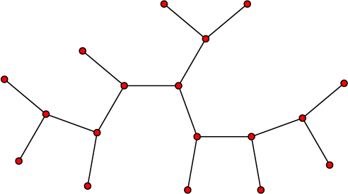

# Trees

## What is a tree?
> Know that a tree is a connected, undirected graph
> with no cycles.

> *Note that a tree does not have to have a root.*

Example of a tree without a root:

> Know that a rooted tree is a tree in which one
> vertex has been designated as the root. A rooted
> tree has parent-child relationships between
> nodes. The root is the only node with no parent
> and all other nodes are descendants of the root. 

> Know that a binary tree is a rooted tree in which
> each node has at most two children.

> *A common application of a binary tree is as a
> binary search tree.*

Example of a binary tree:

## Uses of rooted trees

> Be familiar with typical uses for rooted trees.

* To store data which has an inherent hierarchical structure (e.g. file system)
* To search and sort data
* To process the syntax of statements in natural and programming languages for compiling programming code 
