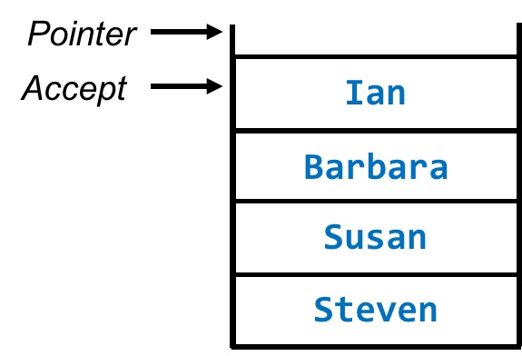

# Abstract Data Types / Data Structures

*Be familiar with the concept and uses of a:*
* *queue*
* *stack*
* *graph*
* *tree*
* *hash table*
* *dictionary*
* *vector*

Queue
=====

Stack
=====

A stack is a data type that operates on either a **last-in first-out (LIFO)** or **first-in first-out (FIFO)** principle.

Items can either be added to or removed from the top of the stack.

A *pointer* indicates the top of the stack.

Uses of a stack
---------------

* Calling procedures in programs
* Recursive calculations
* Reversing array items
* Performing *reverse polish* calculations
* Holding return addresses and system states for recursive function calls

When a routine is called, the computer allocates memory in the stack.

Each time a procedure is called by another procedure, it is pushed onto the stack.

When a function is used, the returned value is allocated to a variable; the variable’s memory location is stored to the **stack frame**.

At the end of a routine, the value is stored to the return address, control is passed back to the main function and stack frame is removed from the stack.

Graph
=====

Tree
====

Hash Table
=========

Dictionary
==========

Vector
======

> Be able to distinguish between static and dynamic
> structures and compare their uses, as well as
> explaining the advantages and disadvantages of
> each.

## Static Structures

Static structures are data structures which have a fixed size. 
They are good for storing a well-defined number of elements.

### Uses of static structures

A static structure may be used: 

* To store a list of the top 5 most retweeted tweets
* To store the 10 last commands in order to implement an undo function

### Advantages and Disadvantages

| Advantages | Disadvantages |
| : -------- | : ----------- |
| Fixed memory use | Cannot add more elements if structure is full |
| No problems in adding or removing data items if structure not full | Can be ineffienct as memory for the structure has to be set aside 
regardless of whether or not it is needed during program execution |
| Easier to program as there is no need to check data structure size at any point | |

## Dynamic Structures

A dynamic data structure is one in which the number of elements to be stored is unknown.
The data structure will grow and shrink as demand arises.

Dynamic structures use locations allocated from the heap.

When implementing a dynamic structure, the programmer should set a max size to avoid memory collisions.

### Uses of dynamic structures

A dynamic structure may be used:

* To keep a record of print jobs for a printer spooler as the number of jobs will not be known beforehand
* To store a list of all tweets from your account on twitter

### Advantages and Disadvantages

| Advantages | Disadvantages |
| : -------- | : ----------- |
| Memory efficient as the structure only uses memory which is required and has no excess | 
Harder to program as the structure must keep track of its size and location of its elements at any given time |
| | Due to the data allocation being dynamic, the structure could overflow its allowed limit (require more memory than is available) |
