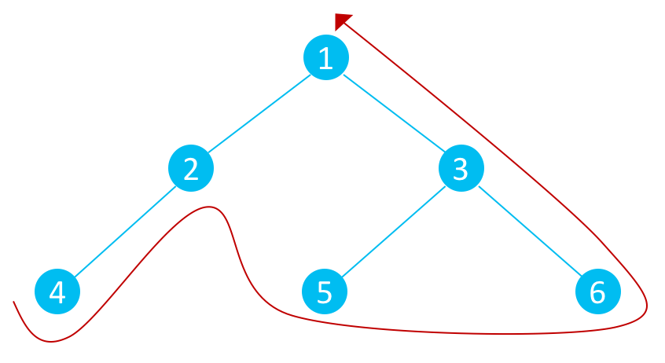

# Simple tree-traversal algorithms

> Be able to trace the tree-traversal algorithms:
> * pre-order
> * post-order
> * in-order

## Pre-order Traversal

Pre-order traversal is when you visit the parent first, and then the left then right child.

To spot a pre-order traversal you will start at the root and then traverse left.

### Steps
1. Start at root node
2. Explore the left sub-tree, working top-down
3. Explore the right sub-tree, working top-down

## In-order Traversal

In-order traversal is where you visit the left child, the parent and then the right child.

To spot in-order traversal you will start at the left most child (the deepest left child).

### Steps
1. Explore the left sub-tree, working bottom-up 
2. Visit root node
3. Explore the right sub-tree, working bottom-up

## Post-order Traversal

Post-order traversal is when you visit the left child, the right child and then the parent.

### Steps
1. Explore the left sub-tree, working bottom-up 
2. Explore the right sub-tree, working bottom-up
3. Visit root node

## Uses

> Be able to describe uses of tree-traversal
> algorithms.

### *Additional information* 

> Pre-Order: copying a tree.
> In-Order: binary search tree, outputting the
> contents of a binary search tree in ascending
> order.
> Post-Order: Infix to RPN (Reverse Polish
> Notation) conversions, producing a postfix
> expression from an expression tree, emptying a
> tree.
