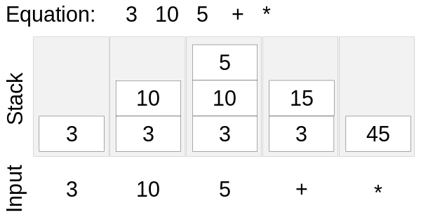

# Reverse Polish – infix transformations

A way of writing mathematical expressions in a format where the operators are written after the operands; 
puts expressions in a format that can be used by the interpreter or compiler.

> Be able to convert simple expressions in infix
> form to Reverse Polish notation (RPN) form and
> vice versa. 

### Infix

The below example is a an infix, they are normally mathemetical expressions. 
The operators are in between the operands.
```
3 + 4
(10 / 2) * (5 + 8)
```

The CPU evalute expressions using the stack, which isn't compatible with the infix notation.

With infix expressions we use parentheses `()` to help the expression not be ambiguous.

### Prefix

Expressions that are written with the operators before the operands, e.g. `+ 3 4`. 
This is polish notation.

### Postfix

Expressions that are written with the operators after the operands, e.g. `3 4 +`. 
This is reverse polish notation.

## Reverse Polish Notation

In RPN, unlike in infix expressions, the operator comes after the operands.

### Example

```
3 4 +
```

If you wanted to evalute the infix expression `(3 + 4) * 5` using RPN it would be `3 4 + 5 *`.

Meaning perform `3 + 4` and then `* 5`.

> Be aware of why and where it is used.

### Advantages

* No need for parentheses - avoid ambiguity
* Calculations occur as soon as an operator is specified
* RPN uses a stack. Intermediate results are available for later use
* RPN calculators have no limit on the complexity of the expressions that can be evaluated
* No equals key required for it to be evaluated

### Uses and applications of RPN

* Used in inerpreters based on a stack
* Used in hp and texas instrument calculators 
* Internally in some computer languages

## Conversions

### Infix to Postfix

| Infix | Postfix | Result | Explaination |
| :---| :--- | :---- | :---- |
| `( 7 * 2 ) + 4` | `7 2 * 4 +` | 18 | Multiply 7 by 2 and add 4 |
| `( 8 * 2 ) / 4` | `8 2 * 4 /` | 4 | Multiply 8 by 2 and divide by 4 |
| `( 8 * 3 ) / ( 3 * 2 )` | `8 3 * 2 5 * /` | 4 | Multiply 8 by 3 and divide by 3 multiplied by 2 |
| `x^2` | `x 2 ^` | | |
| `x + (y ^ 2)` | `x y 2 ^ +` | | |

### Postfix to Infix 

| Postfix | Infix | 
| :---| :--- | 
| `18 3 / 2 +` | `(18 / 3) + 2` | 
| `20 5 / 6 2 + -` | `(20 / 5) - (6 + 2)` | 
| `2 3 * 5 +` | `(2 * 3) + 5` | 
| `A B + C D + *` | `(A + B) * (C + D)` | 
| `3 6 + 2 4 - * 7 +` | `( (3 + 6) * (2 - 4) ) + 7` | 


#### *Additional Information*
> Eliminates need for brackets in sub-expressions.
>
> Expressions in a form suitable for evaluation
using a stack.
>
> Used in interpreters based on a stack for example
Postscript and bytecode.

Operators are applied to the operands at the top of the stack.


