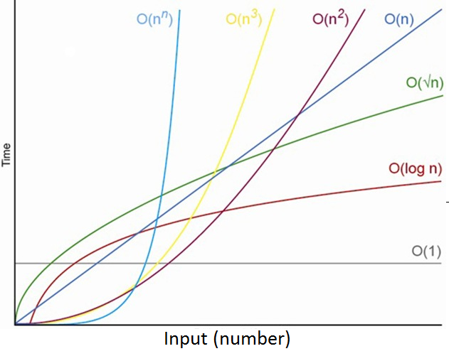

# Comparing algorithms

> Understand that algorithms can be compared by
> expressing their complexity as a function relative
> to the size of the problem. Understand that the
> size of the problem is the key issue.

## Efficiency
> Understand that some algorithms are more
> efficient:
> * time-wise than other algorithms
> * space-wise than other algorithms.

When comparing an algorithm that has time complexity O( n ) and space complexity O( n2) with another algorithm which has time complexity O( n2 ) and space complexity O( n ), it is clear to see that the first is more time efficient whereas the second is more space efficient.

There are benefits to improving time complexity and space complexity and some algorithm prefer to improve space complexity over time complexity.

As the above diagram shows, some more complex algorithms may be more efficient than less complex algorithms for small input sizes, however once a certain size is surpassed, the functions diverge rapidly.

#### *Additional information*

> Efficiently implementing automated abstractions
> means designing data models and algorithms to
> run quickly while taking up the minimal amount of
> resources such as memory.
