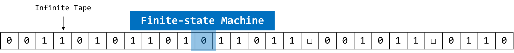
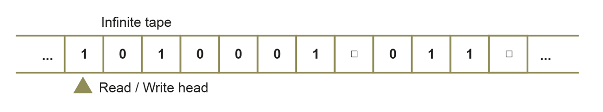
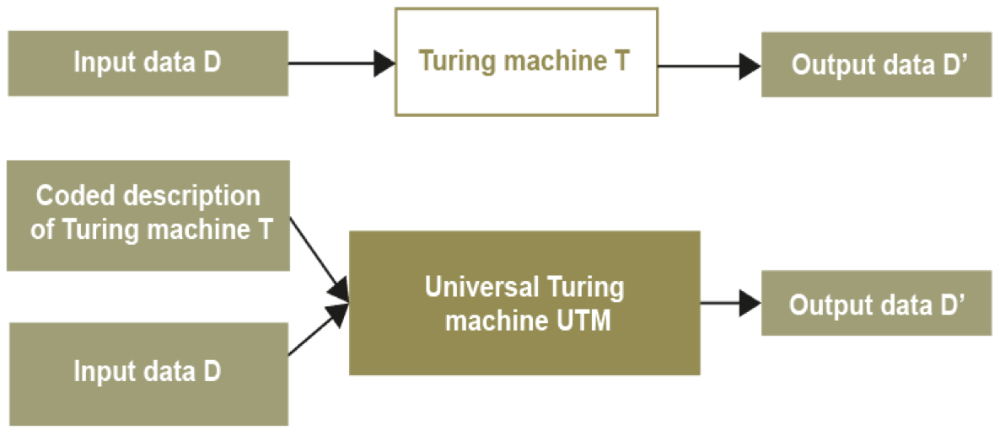

# Turing Machine

> Be familiar with the structure and use of Turing
> machines that perform simple computations.

## What are Turing machines?

The Turing machine is considered the blueprint for modern computers.
It defines what is *computable*.

> Know that a Turing machine can be viewed as a
> computer with a single fixed program, expressed
> using:
> * a finite set of states in a state transition diagram
> * a finite alphabet of symbols
> * an infinite tape with marked-off squares
> * a sensing read-write head that can travel along the tape, one square at a time.

## Structure

A basic Turing machine consists of a read/write head, and an infinitely long tape which is divided into squares.
Each square contains a character.
The read/write head can read data from and write data to the tape.

**Diagram** 
(the blue square indicates the read/write head)

**Diagram 2**
(uses a triangle to show read/write head)

> One of the states is called a start state and states
> that have no outgoing transitions are called
> halting states.

A Turing machine must have a start state, and *at least one* **halting** state, that causes the machine to halt for some inputs.

Any alphabet of symbols may be used but we will generally use only a binary alphabet of 0, 1 and  (representing a blank).

## The Controller

The controller is a finite state machine which tells the machine what to do next.

In any one transition, the machine can:
* Read the symbol on the tape
* Erase or write a new symbol on the tape
* Move the head left or right by a single space

## Transitions

> Understand the equivalence between a transition
> function and a state transition diagram.

> Understand the equivalence between a transition
> function and a state transition diagram.

### Representation

> Be able to:
> * represent transition rules using a transition
> function
> * represent transition rules using a state
> transition diagram
> * hand-trace simple Turing machines.

## Importance of Turing Machines

> Be able to explain the importance of Turing
> machines and the Universal Turing machine to
> the subject of computation.

It provides a definition of what is computable.

It can be priven mathematically that a Turing machine is capable of computing anything that is computable. 

### How many Turing machines?

A Turing machine:

* is a general model of computation
* can be define to represent any computation

However, a different Turing machine would be needed for each individual operation

Turing came up with the idea of a *Universal Turing Machine*.

#### Universal Turing Machines

The Universal Turing Machine reads from the tape:
* the definition of a Turing Machine `T`
* the input data `D`

Using this, the UTM can simulate the behaviour of *any* Turing machine.

The UTM was the breakthrough that led to the idea of the stored program computer.

**Differences between UTM and Turing Machine**

A Turing machine can only represent one program, whereas the UTM can perform any operation as it reads the instructions in as well as the data.
