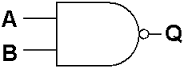

# Logic Gates

> Construct truth tables for the following logic gates:
> * NOT
> * AND
> * OR
> * XOR
> * NAND
> * NOR

## Types of gates

| Name | Truth Table | Shape |
| :--: | :---------: | :---: |
| NOT | <table><tr><th>A</th><th>O</th></tr><tr><td>0</td><td>1</td></tr> <tr><td>1</td><td>0</td></tr></table> |  |
| AND | <table><tr><th>A</th><th>B</th><th>O</th></tr><tr><td>0</td><td>0</td><td>0</td></tr> <tr><td>0</td><td>1</td><td>0</td></tr><tr><td>1</td><td>0</td><td>0</td></tr><tr><td>1</td><td>1</td><td>1</td></tr></table> |   |
| OR | <table><tr><th>A</th><th>B</th><th>O</th></tr><tr><td>0</td><td>0</td><td>0</td></tr> <tr><td>0</td><td>1</td><td>1</td></tr><tr><td>1</td><td>0</td><td>1</td></tr><tr><td>1</td><td>1</td><td>1</td></tr></table> |  |
| XOR | <table><tr><th>A</th><th>B</th><th>O</th></tr><tr><td>0</td><td>0</td><td>0</td></tr> <tr><td>0</td><td>1</td><td>1</td></tr><tr><td>1</td><td>0</td><td>1</td></tr><tr><td>1</td><td>1</td><td>0</td></tr></table> | |
| NAND | <table><tr><th>A</th><th>B</th><th>O</th></tr><tr><td>0</td><td>0</td><td>1</td></tr> <tr><td>0</td><td>1</td><td>1</td></tr><tr><td>1</td><td>0</td><td>1</td></tr><tr><td>1</td><td>1</td><td>0</td></tr></table> | |
| NOR | <table><tr><th>A</th><th>B</th><th>O</th></tr><tr><td>0</td><td>0</td><td>1</td></tr> <tr><td>0</td><td>1</td><td>0</td></tr><tr><td>1</td><td>0</td><td>0</td></tr><tr><td>1</td><td>1</td><td>0</td></tr></table> | |

## Flip Flops

A flip-flop is a type of circuit which contains two states is often used to store state information. It can only store one bit.

### S-R Flip Flop

An S-R Flip Flop is a flip flop which has a set and reset function.

**Truth Table**

Anytime a flip-flop is set, Q goes high.

Anytime a flip-flop is reset, Q goes low.

| S | R | Q | !Q |
| :--- | :--- | :--- | :--- |
| 0 | 0 | Q | \!Q | 
| 1 | 0 | 1 | 0 | 
| 0 | 1 | 0 | 1 |
| 1 | 1  | X | X |

The `1,1` input has undetermined output.

### D-type Flip Flop

> Be familiar with the use of the edge-triggered
> D-type flip-flop as a memory unit.

A D-type flip flop uses an enabler to be able to easily manage the stored state.
If the enabler is low then nothing will change in the state, however if the enable is high then the state man be modified.

| Enabler | X | Q |
| :-----: | :--- | :--- |
| 0 | 0 | Q |
| 0 | 1 | Q |
| 1 | 0 | 0 |
| 1 | 1 | 1 |

**Additional Information**
> Knowledge of internal operation of this flip-flop is
> not required.
