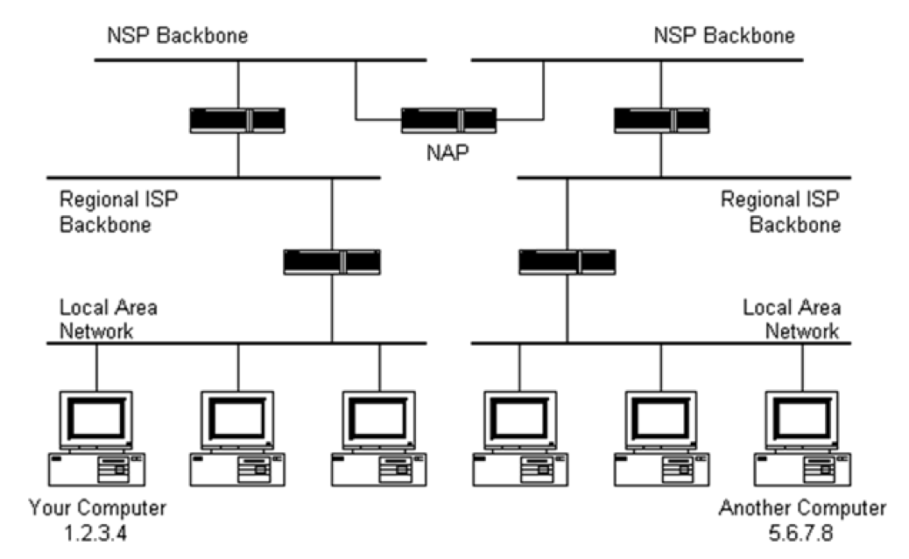

# The Internet and how it works

## Structure of the internet
> Understand the structure of the internet

The internet is a network of computer networks and computers using unique IP addresses and TCP/IP.

The internet has no governing body or central structure, meaning it is very robust. If a connection between two hosts goes down, then there is most likely another route a packet could take.

The Internet backbone is made up of many large networks which are connected to one another. 
These large networks are known as **Network Service Providers** or **NSPs**, and they exchange packet traffic.
Each NSP is required to connect to 3 **Network Access Points** or **NAPs**, where packet traffic may jump from one NSP's backbone to another NSP's backbone.
NSPs interconnect at the **Metropolitain Area Exchanges** which are privately owned but perform the same function as an NAP. NSPs also sell bandwidth to ISPs.

## Packets

### What is a packet?
> Know the main components of a packet

A packet is a manageable chunk of data sent across networks.

A packet consists of:
* Source address
* Destination address
* Data

The packet could also be viewed as having three main sections:
* Header - Sender's IP, Destination IP, Protocol, Packet Number
* Payload - Data
* Trailer - Data to signify the end of a packet, error correction

### Routing
> Understand the role of packet switching and routers

The internet is based on packet switching.

**Packet Switching**

Packet switching is responsible for finding the quickest route for each packet in a transmission from the host to destination.

Each packet in a packet switched network may take a different route and therefore the packets may arrive out of order.
To fix this each packet includes a packet number, allowing the message to be resequenced at the destination.

*Benefits:*
* Always takes the fastest route for each packet
* Doesn't *hog* the network - frees up sections for other transmissions

*Issues:*
* Packets can get stuck in loops (however once the hop count reaches a threshold, the packet is destroyed and resent)

**Routers**

Routers are used to switch packets between networks, routing them from their source to destination.

They are usually connected between networks to route packets between them.

Each router will know about its sub-networks and their IP address space but not about the IP address space above it.

A router will keep a routing table. This is used to get packets to their destinations and contains a list of IP addresses.

## Routers and Gateways

### Routers

A router is a networking device which forwards data packets across computer networks.

### Gateways

A gateway is router which is on the edge of a network and is capable of joining two networks which use different base protocols. It does this by performing a conversion function on the data it receives.
